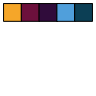
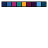

<!-- README.md is generated from README.Rmd. Please edit that file -->
<!-- use devtools::build_readme() to update README.md -->

# OBI.color

OBI Style guidance document is
[HERE](files/OBI%20Style%20Guide_Winter%202022.pdf)

The goal of OBI.color is to put OBI style colors in one place, so we
don’t have to use hex to define colors.

The OBI style colors are based on OBI Style Guide

## Installation

Install the development version directly from GitHub:

``` r
# install.packages("devtools")
devtools::install_github("obianalysts-umich/OBI.color")
```

## Naming convention

Color names are based on this document.

- All three primary colors are named as `prim_`, and are combines in
  `primary_colors_3()`
- Six secondary colors are in `secondary_colors_6()`
- Seven tertiary colors are in `tertiary_colors_7()`

## Example: Use 3 primary colors

``` r
library(OBI.color)
library(tidyverse)
#> ── Attaching packages ─────────────────────────────────────── tidyverse 1.3.2 ──
#> ✔ ggplot2 3.4.0      ✔ purrr   0.3.4 
#> ✔ tibble  3.1.8      ✔ dplyr   1.0.10
#> ✔ tidyr   1.2.1      ✔ stringr 1.4.1 
#> ✔ readr   2.1.2      ✔ forcats 0.5.2 
#> ── Conflicts ────────────────────────────────────────── tidyverse_conflicts() ──
#> ✖ dplyr::filter() masks stats::filter()
#> ✖ dplyr::lag()    masks stats::lag()
ggplot(data = iris,
      aes(x = Sepal.Length, y = Petal.Length, color = Species)) +
 geom_point() +
 # use OBI colors
 scale_color_manual(values = primary_colors_3()) +
 theme_minimal()
```


## Color Palette

This is a basic example which shows you how to solve a common problem:

### Primary Colors

3 colors : “\#0B3357” “\#5062A5” “\#79AEA3”

``` r
p = primary_colors_3(show_color = T)
```


### Secondary colors

6 colors : “\#AB91A5” “\#7492BF” “\#98C1D9” “\#CAC4CE” “\#FCDB88”
“\#F8F4E9”

``` r
s = secondary_colors_6(show_color = T)
```



### Tertiary colors

7 colors : “\#BDD9BF” “\#929084” “\#FFC857” “\#A997DF” “\#E5323B”
“\#FCB2A7” “\#2E4052”

``` r
t = tertiary_colors_7(show_color = T)
```


